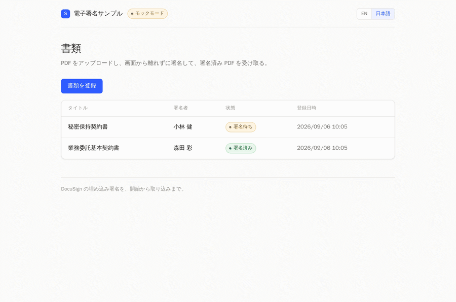
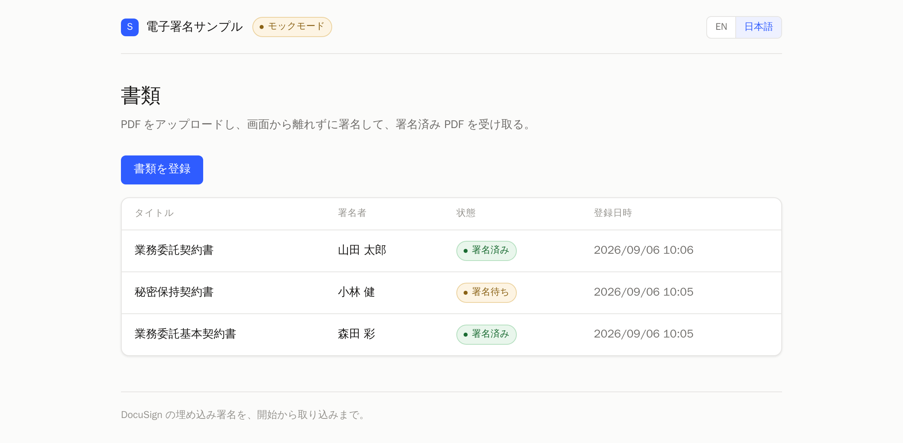
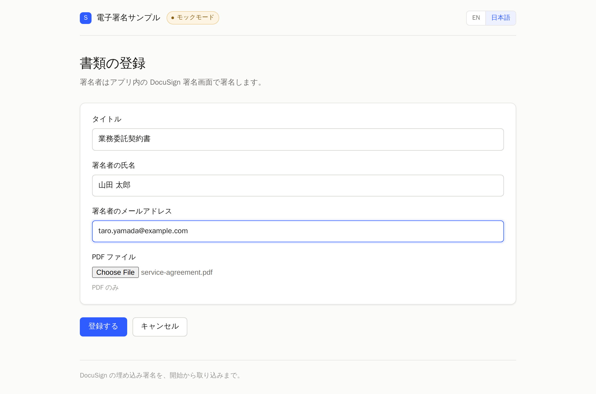
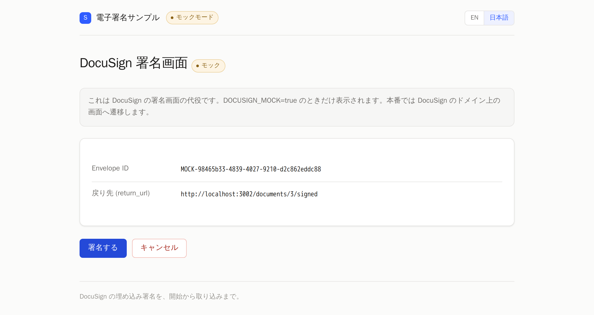
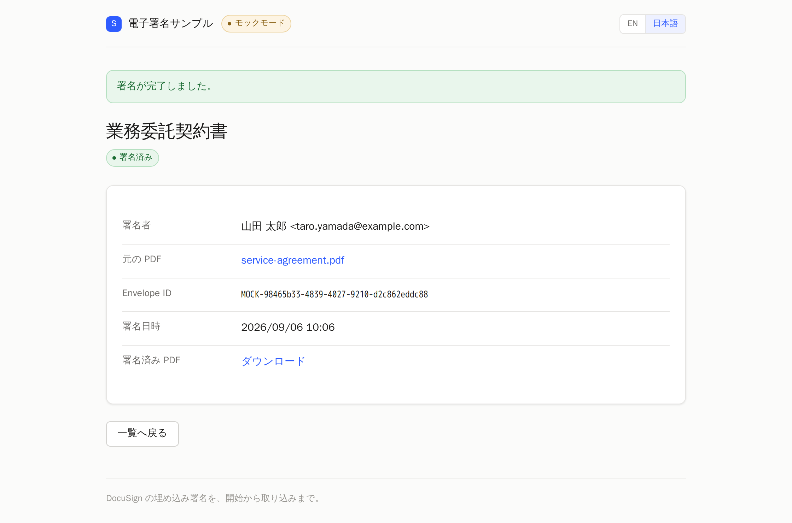

# DocuSign 埋め込み署名サンプル

*[English](README.md) | 日本語*

PDF をアップロードして、**アプリの画面から離脱せずに** DocuSign で署名し、
署名済み PDF を自分のシステムに取り込むまでの一周を実装しています。

**DocuSign のアカウントがなくても動きます。** 既定でモックモードが有効なので、
資格情報を用意する前にフロー全体を確認できます。

<p align="center">
  
</p>

<details>
<summary>その他のスクリーンショット</summary>

<p>
  
  
  
  
</p>

</details>


| | |
|---|---|
| 言語 / FW | Ruby 3.4 / Rails 8.0 |
| DB | SQLite |
| 外部サービス | DocuSign eSignature API（`docusign_esign` gem） |
| 認証方式 | JWT Grant（impersonation） |
| 署名方式 | 埋め込み署名（embedded signing） |
| UI | 英語 / 日本語、ライト + ダーク、レスポンシブ |

設計は [docs/architecture.ja.md](docs/architecture.ja.md) を参照してください。

## 動かす

Docker と Docker Compose があれば、他に何も要りません。

```bash
cp .env.example .env
docker compose build
docker compose run --rm web bundle install
docker compose run --rm web bin/rails db:prepare
docker compose up
```

http://localhost:3000 を開きます。

`.env` は初期状態で `DOCUSIGN_MOCK=true` なので、そのまま一周できます。

1. 「書類を登録」から PDF をアップロード（`sample_files/service-agreement.pdf` が使えます）
2. 詳細画面で「署名する」
3. DocuSign 署名画面の代役が開くので「署名する」
4. 元の画面に戻り、署名済み PDF がダウンロードできる

UI の言語は `Accept-Language` から自動判定し、判定できなければ英語になります。
ヘッダーのスイッチで明示的に切り替えられます。

## 実際の DocuSign につなぐ

`.env` を編集します。

```diff
-DOCUSIGN_MOCK=true
+DOCUSIGN_MOCK=false
```

加えて `DOCUSIGN_INTEGRATION_KEY` / `DOCUSIGN_ACCOUNT_ID` / `DOCUSIGN_USER_ID` /
`DOCUSIGN_PRIVATE_KEY_BASE64` を設定します。取得手順は
[docs/docusign-setup.ja.md](docs/docusign-setup.ja.md) にまとめてあります。
開発者アカウント（無料）で動作します。

Compose は `.env` をコンテナ作成時に読むので、**再起動ではなく作り直し**が必要です。

```bash
docker compose up -d --force-recreate
```

実 API に切り替わると、ヘッダーの「モックモード」バッジが消えます。

## 構成

```
app/
├── models/
│   ├── document.rb              署名対象の書類
│   └── signature.rb             1回の署名依頼。DocuSign の Envelope と 1:1
├── controllers/
│   ├── documents_controller.rb  登録と署名フローの入口
│   └── mock_docusign_controller.rb  モックモード時の DocuSign 署名画面の代役
└── services/docusign/
    ├── gateway.rb               DocuSign との境界。実装を切り替える
    ├── api_gateway.rb           本物の DocuSign を呼ぶ実装
    ├── mock_gateway.rb          資格情報なしで動かす実装
    ├── jwt_client.rb            JWT Grant でのトークン取得とキャッシュ
    ├── envelope_creator.rb      Envelope 作成・署名URL発行・署名済みPDF取得
    ├── sign_service.rb          署名フローの業務ロジック
    ├── signer_config.rb         署名者1名分の設定値
    ├── event.rb                 DocuSign から返る event の解釈
    └── error.rb                 例外と API エラーの構造化ログ
config/locales/                  en.yml / ja.yml
```


## テスト

```bash
docker compose run --rm web bundle exec rspec
```

モデル・署名フロー・HTTP の一周を通した 29 例。`signing_complete` イベントを
偽装しても書類が署名済みにならないことの確認も含みます。

`RAILS_ENV=test` を固定し、`Docusign::Gateway.mock?` を強制しているため、
**テスト実行が実際の DocuSign に到達することはありません**。資格情報も不要です。

## CI

[`.github/workflows/ci.yml`](.github/workflows/ci.yml) が push と Pull Request で動きます。

| ジョブ | 内容 |
|---|---|
| RSpec | 上記のテスト（SQLite） |
| RuboCop | `rubocop-rails-omakase` |
| Security | Brakeman と、Ruby Advisory Database に対する bundler-audit |

[`.github/workflows/deploy.yml`](.github/workflows/deploy.yml) はデプロイのテンプレートです。
イメージをビルドして ECR に push し、ECS サービスを入れ替えて安定するまで待ちます。
2点補足します。

- 長期のアクセスキーではなく **OIDC** で認証する
- ロール ARN を Secrets から取るので、**AWS アカウント ID がリポジトリに現れない**

AWS 側の準備が無いと成功しないため、トリガーは `workflow_dispatch` のみにしています。

## 制限

サンプルとして読みやすさを優先し、意図的に外している点です。

- **署名者は1名固定。** 複数名の順次署名（routing order）には対応していません
- **完了検知はポーリング型。** DocuSign Connect（Webhook）は使っていません
- **認証・認可なし。** 誰でも全書類を閲覧できます
- モックモードの「署名済み PDF」は、アップロードした PDF をそのまま返します（証明書ページなし）

## ライセンス

[MIT](LICENSE)
