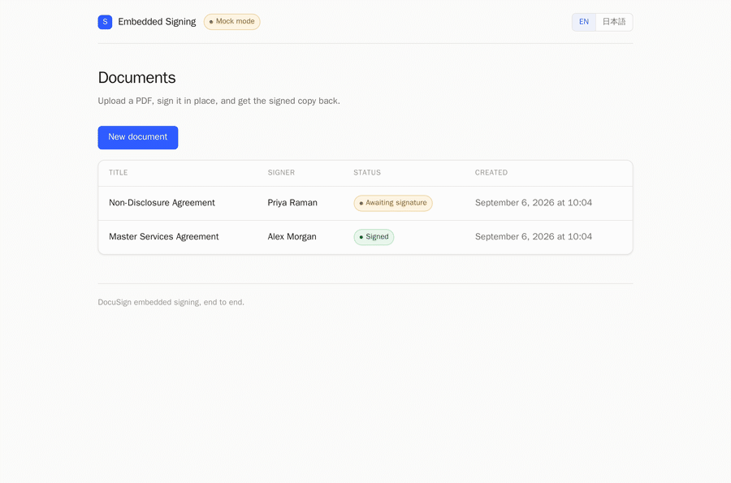
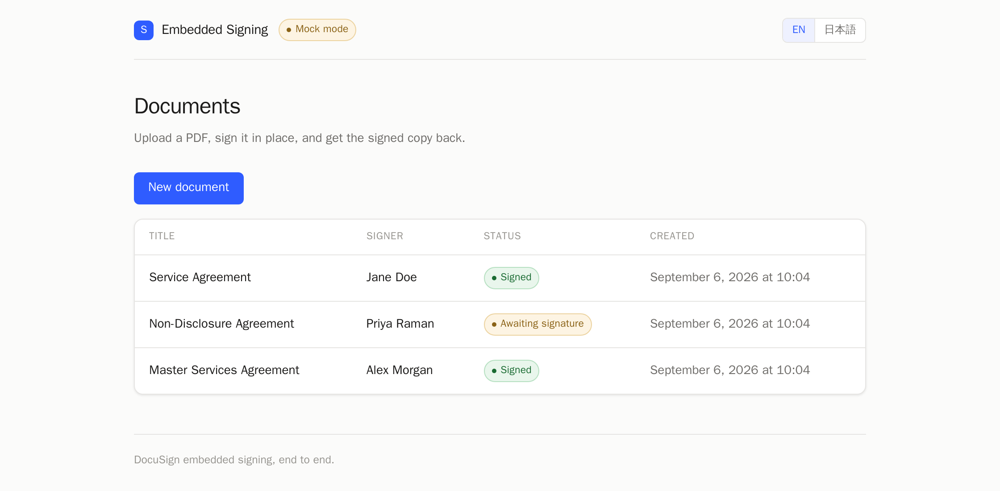
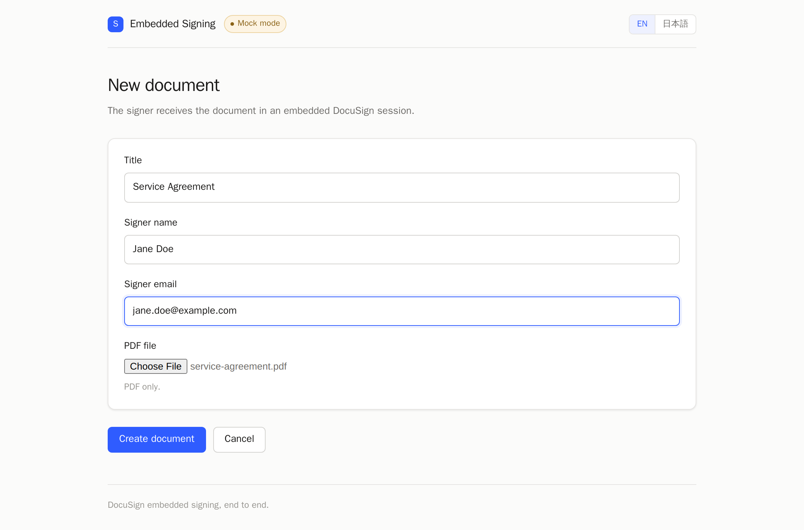
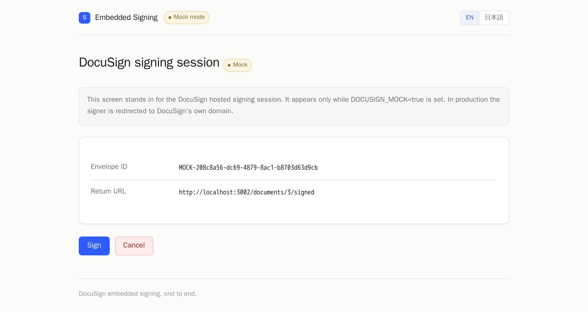
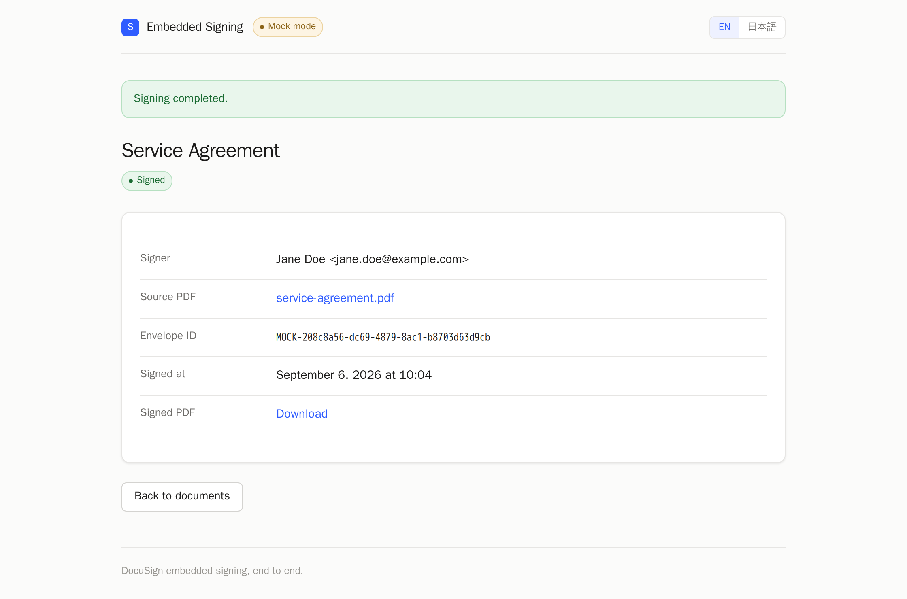

# DocuSign Embedded Signing Sample

*English | [日本語](README.ja.md)*

Upload a PDF, sign it **without leaving the application**, and store the signed
copy back in your own system — the full DocuSign embedded signing round trip.

**It runs with no DocuSign account.** Mock mode is on by default, so you can
exercise the entire flow before touching any credentials.

<p align="center">
  
</p>

<details>
<summary>More screenshots</summary>

<p>
  
  
  
  
</p>

</details>


| | |
|---|---|
| Language / framework | Ruby 3.4 / Rails 8.0 |
| Database | SQLite |
| External service | DocuSign eSignature API (`docusign_esign` gem) |
| Authentication | JWT Grant (impersonation) |
| Signing mode | Embedded signing |
| UI | English / Japanese, light + dark, responsive |

See [docs/architecture.md](docs/architecture.md) for the design.

## Run it

Docker and Docker Compose are the only prerequisites.

```bash
cp .env.example .env
docker compose build
docker compose run --rm web bundle install
docker compose run --rm web bin/rails db:prepare
docker compose up
```

Open http://localhost:3000.

`.env` ships with `DOCUSIGN_MOCK=true`, so the flow works immediately:

1. **New document** — upload a PDF (`sample_files/service-agreement.pdf` works)
2. **Sign this document**
3. A stand-in for the DocuSign signing screen appears — press **Sign**
4. You land back on the document, with the signed PDF ready to download

The UI picks its language from `Accept-Language` and falls back to English.
Use the switch in the header to override it.

## Connect a real DocuSign account

Edit `.env`:

```diff
-DOCUSIGN_MOCK=true
+DOCUSIGN_MOCK=false
```

Then set `DOCUSIGN_INTEGRATION_KEY`, `DOCUSIGN_ACCOUNT_ID`, `DOCUSIGN_USER_ID`
and `DOCUSIGN_PRIVATE_KEY_BASE64`. [docs/docusign-setup.md](docs/docusign-setup.md)
walks through obtaining them; a free developer account is enough.

Compose reads `.env` when the container is created, so recreate it rather than
restarting:

```bash
docker compose up -d --force-recreate
```

The **Mock mode** badge in the header disappears once you are on the real API.

## Layout

```
app/
├── models/
│   ├── document.rb              a document awaiting signature
│   └── signature.rb             one signing request; 1:1 with a DocuSign envelope
├── controllers/
│   ├── documents_controller.rb  upload and signing entry points
│   └── mock_docusign_controller.rb  stands in for DocuSign in mock mode
└── services/docusign/
    ├── gateway.rb               boundary to DocuSign; picks the implementation
    ├── api_gateway.rb           real DocuSign
    ├── mock_gateway.rb          credential-free stand-in
    ├── jwt_client.rb            JWT Grant token retrieval and caching
    ├── envelope_creator.rb      envelope creation, signing URLs, signed PDF
    ├── sign_service.rb          the signing workflow
    ├── signer_config.rb         one signer's configuration
    ├── event.rb                 interprets DocuSign's event parameter
    └── error.rb                 error types and structured API logging
config/locales/                  en.yml / ja.yml
```

## Scope

Deliberately left out, to keep the sample readable:

- **One signer per document.** Sequential multi-party signing (routing order) is not implemented
- **Polling, not webhooks.** DocuSign Connect is not wired up
- **No authentication.** Every visitor sees every document
- In mock mode the "signed" PDF is the uploaded file returned unchanged, with no certificate page

## License

[MIT](LICENSE)
