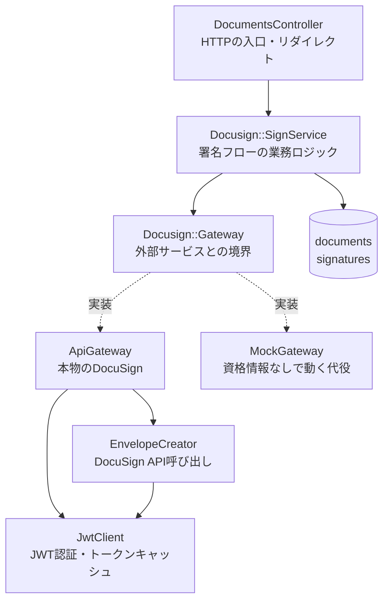
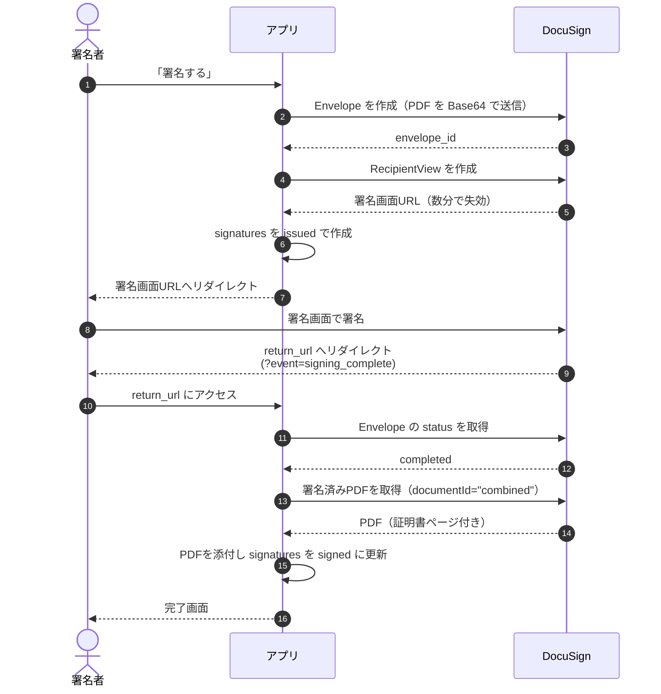
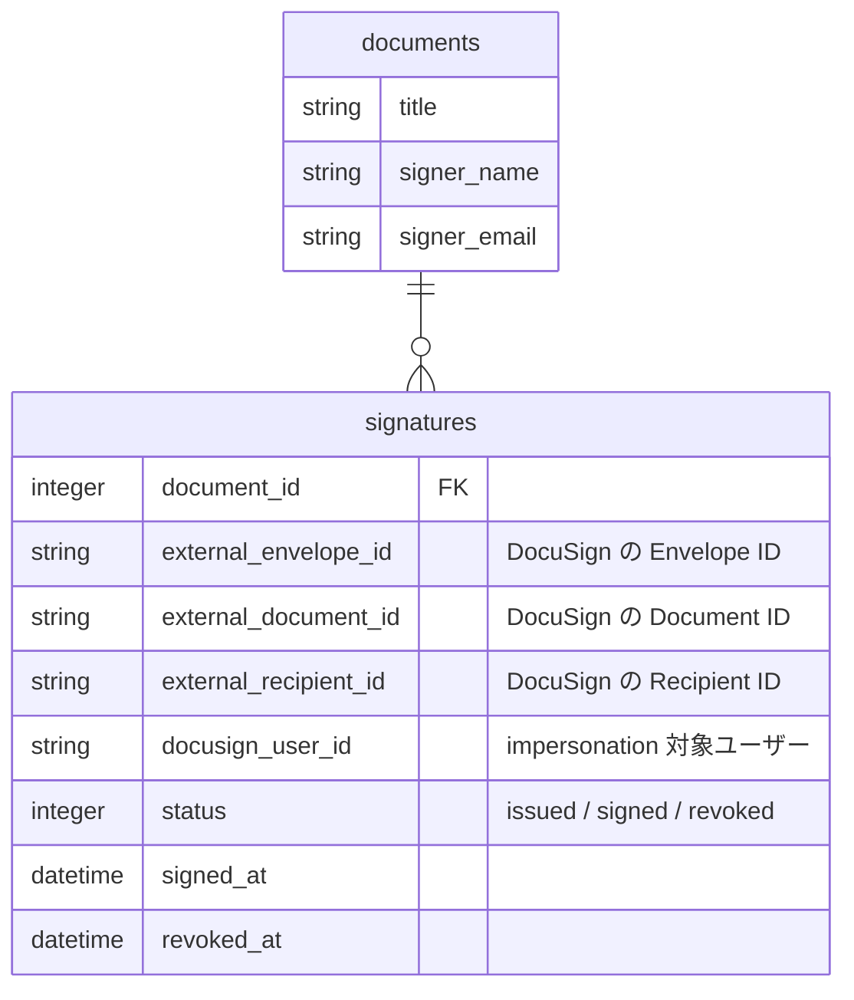

# 設計

*[English](architecture.md) | 日本語*

## 何を解いているか

「アプリ内で PDF に電子署名させ、署名済み PDF を自分のシステムに取り込む」という要件を、
DocuSign eSignature API で実現する。

素直に DocuSign を使うと、署名者にメールが飛び、署名者は DocuSign 上で完結してしまう。
これだとアプリ側は署名の完了を知れず、署名済み PDF も手元に残らない。
そこで **埋め込み署名（embedded signing）** を使い、署名画面をアプリのフローの一部に組み込む。

## レイヤ構成

`SignService` が依存するのは `Gateway` のインターフェースだけで、DocuSign SDK には触らない。
この境界があるおかげで、DocuSign のアカウントを持っていなくても
`DOCUSIGN_MOCK=true` でフロー全体を動かして確認できる。

## 署名フロー

## 設計上の判断

### event パラメータを信用しない

`return_url` には `?event=signing_complete` が付いて戻ってくるが、これは
**ブラウザ経由で渡ってくる値**であり、URL を直接叩けば誰でも付けられる。

そのため `event` は「画面がどう閉じたか」の判断にだけ使い、
署名が成立したかどうかは必ず `GET /envelopes/{id}` で `status == "completed"` を
確認してから PDF を取り込む（`SignService#finish_signing!`）。

### 署名タブのダミーを1つ置く

DocuSign は「署名者に紐づくタブが1つも無い Envelope」を完了状態にできない。
実際の署名欄が PDF 側にある場合でも、API 上は何らかのタブが必要になる。

そこで `locked: true` / `required: false` の空の Text タブを1つだけ置いている
（`EnvelopeCreator#placeholder_tab`）。これは DocuSign の仕様上の要求を満たすための
ダミーで、署名者の画面には実質的に現れない。

### documentId に "combined" を使う

署名済み PDF の取得時、documentId に個別の ID ではなく `"combined"` を指定すると、
Envelope 内の全ドキュメントに**署名証明書ページを結合した1つの PDF** が返る。
「いつ、誰が、どの IP から署名したか」の記録が付くため、証跡としてはこちらを保存する。

### アクセストークンをキャッシュする

JWT Grant で取れるトークンの有効期限は最大1時間。
毎リクエストで発行すると DocuSign 側のレート制限に当たるため、
`Rails.cache` に 50 分だけ載せて使い回す（`JwtClient#access_token`）。

### 署名のやり直し

署名画面 URL は数分で失効する。ユーザーが署名せずに離脱した場合、
再度「署名する」を押すと、進行中の `signatures` を `revoked` にしてから
Envelope を作り直す（`Document#revoke_pending_signatures!`）。

`revoked_at` で論理削除しているのは、署名依頼の履歴を残すため。
`active` スコープが `revoked_at IS NULL` で現行のレコードだけを引く。

## データモデル

DocuSign 側の識別子には `external_` を付けて、自システムの ID と区別している。
`document_id` は `documents` への外部キーと DocuSign の documentId で名前が衝突するため、
この接頭辞がないと事故る。

`docusign_user_id` を署名レコードに持たせているのは、impersonation の対象ユーザーが
将来変わっても、**その Envelope を作ったときのユーザーで**認証し直せるようにするため。
進行中の Envelope を別ユーザーの権限で触ろうとすると DocuSign 側で弾かれる。

## 国際化

ロケールの決定は `ApplicationController#resolved_locale` にあり、優先順位は次のとおり。

1. 明示的な `?locale=` の指定（セッションに保持）
2. ブラウザの `Accept-Language` ヘッダ
3. `I18n.default_locale`（英語）

`Accept-Language` の品質値（`q=`）は無視している。ブラウザは既に優先順で送ってくるため。
