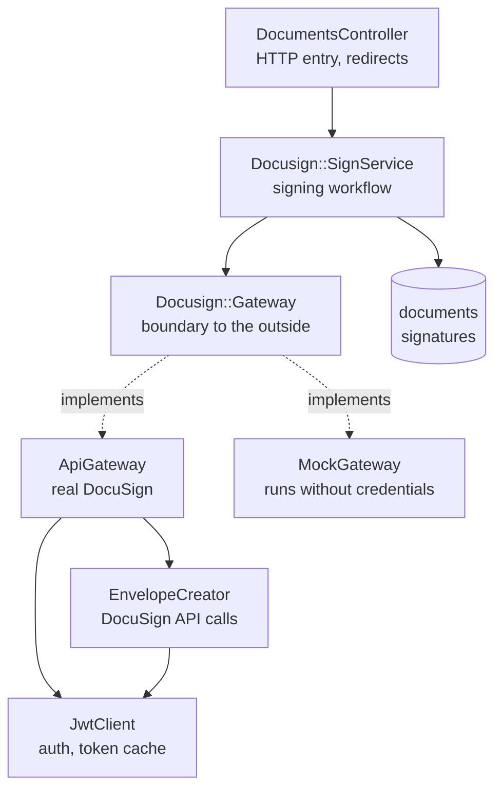
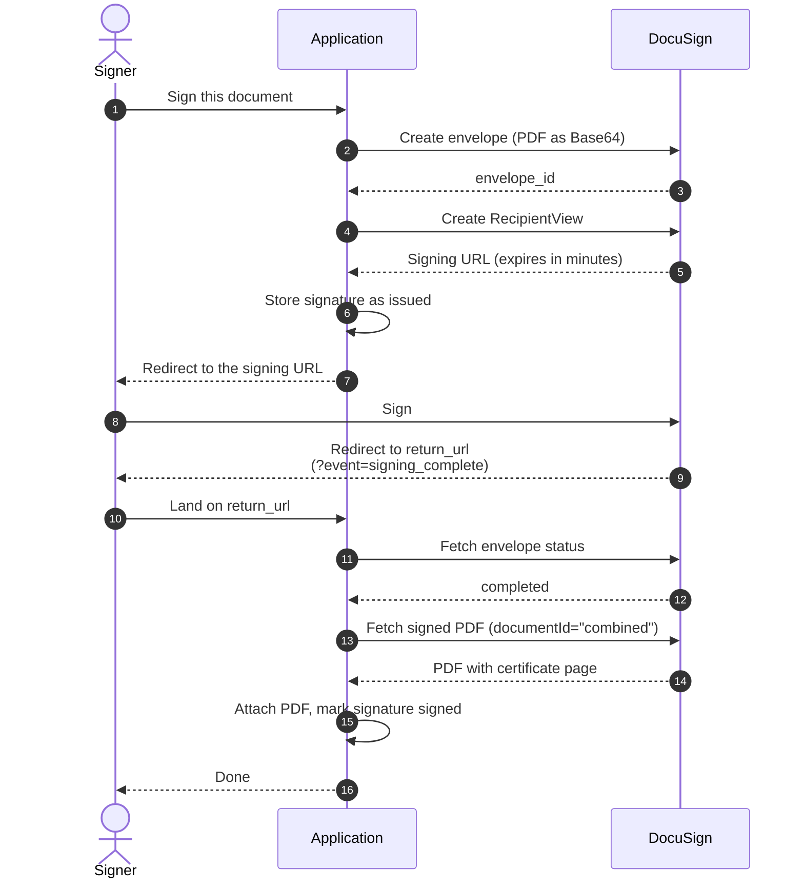
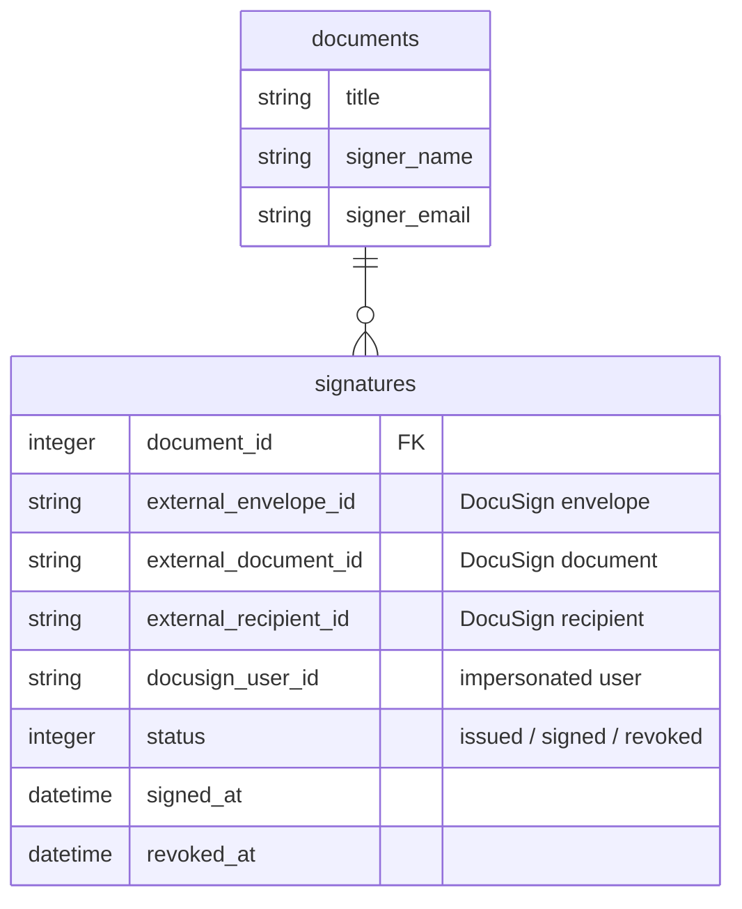

# Design

*English | [日本語](architecture.ja.md)*

## The problem

Let a user sign a PDF inside your own application, and keep the signed copy.

Used naively, DocuSign emails the signer a link and the signing happens entirely
on DocuSign's side. The application never learns that signing finished and never
gets the signed file. **Embedded signing** solves this: the signing screen becomes
one step of the application's own flow.

## Layers

`SignService` depends on the `Gateway` interface only; it never touches the
DocuSign SDK. That boundary is what makes `DOCUSIGN_MOCK=true` possible: the
entire flow, including persistence, runs on the production code path with a
different implementation swapped in at one point.

## The signing flow

## Decisions worth explaining

### The event parameter is not evidence

DocuSign appends `?event=signing_complete` to `return_url`, but that value
travels through the browser — anyone can type it into the address bar.

So `event` only drives the message shown to the user. Whether signing actually
happened is decided by calling `GET /envelopes/{id}` and checking for
`status == "completed"` before importing anything (`SignService#finish_signing!`).

### A placeholder tab is required

DocuSign will not let an envelope complete if the signer has no tabs attached.
When the signature block is drawn in the PDF itself, there is nothing natural to
attach, and the envelope silently never completes.

`EnvelopeCreator#placeholder_tab` parks one empty text tab with `locked: true`
and `required: false` to satisfy the constraint. The signer never sees it.

### "combined" is the document worth keeping

Requesting `documentId = "combined"` returns every document in the envelope
merged with the **signing certificate page** — who signed, when, and from which
IP address. That is the copy that holds up as evidence, so it is what gets stored.

### Access tokens are cached

JWT Grant tokens last at most an hour. Minting one per request hits DocuSign's
rate limits quickly, so `JwtClient` caches each token in `Rails.cache` for
50 minutes, keyed by the impersonated user.

### Restarting a signing flow

Signing URLs expire within minutes. If the signer walks away and comes back,
pressing Sign again revokes the in-flight `signatures` row and builds a fresh
envelope (`Document#revoke_pending_signatures!`).

Revocation is a soft delete via `revoked_at` so the history of signature requests
stays auditable; the `active` scope filters to `revoked_at IS NULL`.

## Data model

DocuSign-side identifiers carry an `external_` prefix. Without it,
`document_id` would mean both "the foreign key to documents" and "DocuSign's
document id" — a collision that bites the moment you write the migration.

`docusign_user_id` is stored per signature so an in-flight envelope can still be
authenticated after the default impersonated user changes. DocuSign rejects
attempts to touch an envelope as a different user.

## Internationalisation

Locale resolution lives in `ApplicationController#resolved_locale`, in
descending priority:

1. an explicit `?locale=` choice, remembered in the session
2. the browser's `Accept-Language` header
3. `I18n.default_locale` (English)

Quality values in `Accept-Language` are ignored, because browsers already send
the list in preference order.
